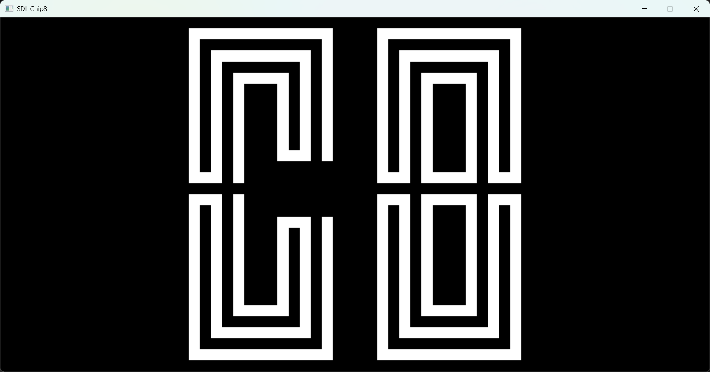
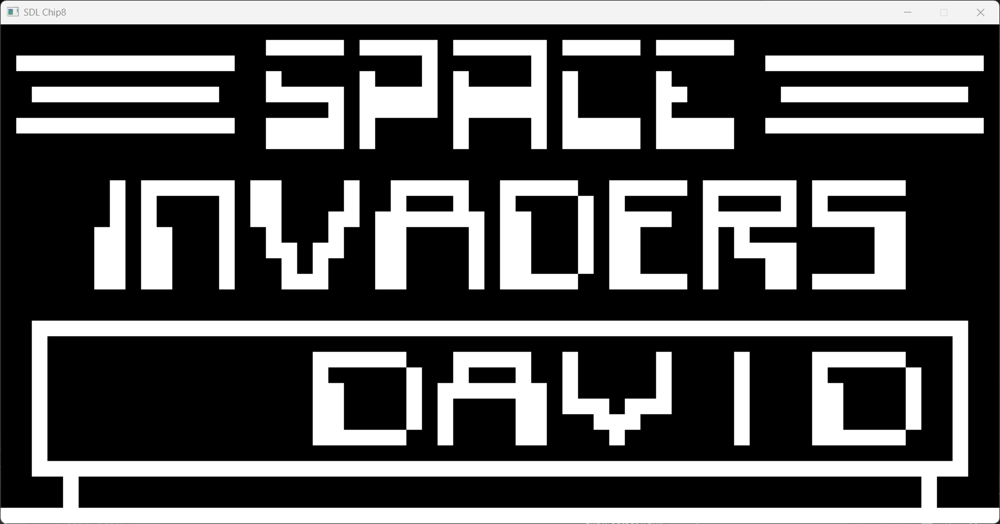

# Chip8 Emulator

A simple Chip8 emulator built using SDL2 for rendering and input handling implemented per [CHIP-8 Instruction Set](https://github.com/mattmikolay/chip-8/wiki/CHIP%E2%80%908-Instruction-Set) and [Wikipedia](https://en.wikipedia.org/wiki/CHIP-8)

This project aims to faithfully emulate the Chip8 virtual machine and its games, providing an easy way to run classic Chip8 ROMs on modern systems.

---
 
## Features

- Full implementation of the Chip8 instruction set
- SDL2-based graphics rendering with scaling support
- Keyboard input mapped to Chip8 keypad
- Modular and extensible codebase for easy future improvements

---

## Planned Features

- **Dear ImGUI integration** for a graphical user interface to control emulator settings, debug info, and runtime options
- Save/load state support
- Improved debugging tools and opcode visualization
- Performance optimizations

---
